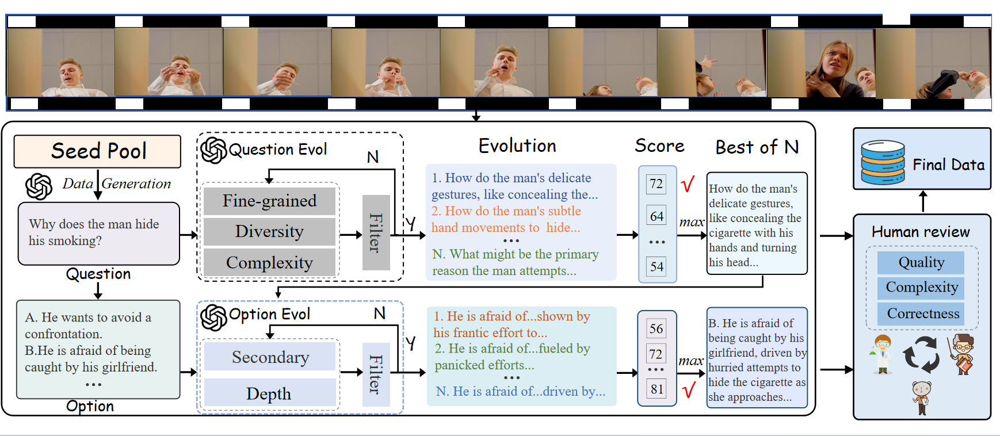

# MTMEUR
<a href="./LICENSE"></a><a href='https://arxiv.org/pdf/2508.16859'></a>

[Beyond Emotion Recognition: A Multi-Turn Multimodal Emotion Understanding and Reasoning Benchmark](https://arxiv.org/abs/2508.16859)


We have released the dataset on huggingface! For model downloads, please click here: [MindIntLab/MTMEUR](https://huggingface.co/datasets/MindIntLab/MTMEUR)


## Introduction
Multimodal large language models (MLLMs) have been widely applied across various fields due to their powerful perceptual andreasoning capabilities. In the realm of psychology, these modelshold promise for a deeper understanding of human emotions and behaviors. However, recent research primarily focuses on enhancingtheir emotion recognition abilities, leaving the substantial potentialin emotion reasoning, which is crucial for improving the naturalness and effectiveness of human-machine interactions. Therefore, in this paper, we introduce a multi-turn multimodal emotion understanding and reasoning (MTMEUR) benchmark.



## Quick Start
1. Clone this project locally
```bash
git clone https://github.com/MACLAB-HFUT/MTMEUR.git
```
2. Set up the environment
```bash
conda create -n MTMEUR python=3.10
conda activate MTMEUR
pip install -r requirements.txt
```
3. Run the Python file 
```
python evaluation.py
```

## Citation

If this work is helpful, please kindly cite as:

```bibtex
@misc{hu2025emotionrecognitionmultiturnmultimodal,
      title={Beyond Emotion Recognition: A Multi-Turn Multimodal Emotion Understanding and Reasoning Benchmark}, 
      author={Jinpeng Hu and Hongchang Shi and Chongyuan Dai and Zhuo Li and Peipei Song and Meng Wang},
      year={2025},
      eprint={2508.16859},
      archivePrefix={arXiv},
      primaryClass={cs.CV},
      url={https://arxiv.org/abs/2508.16859}, 
}
```
